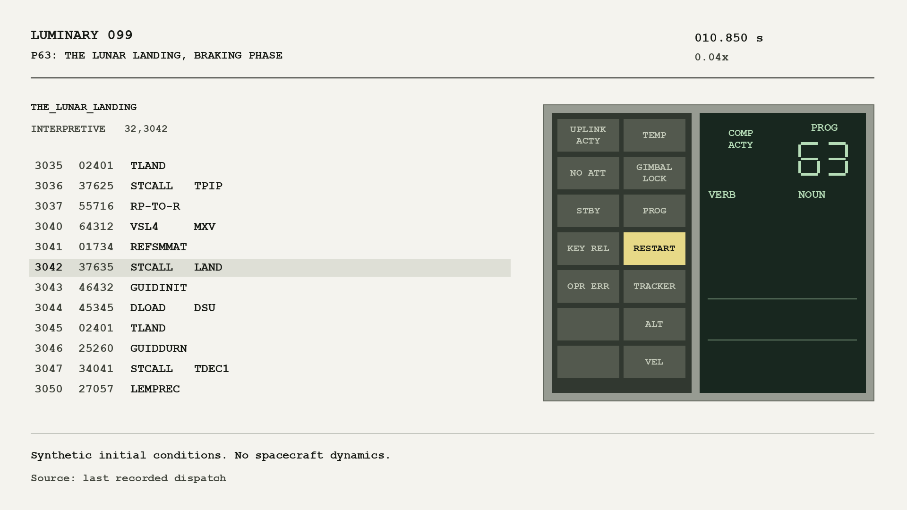

# Hamilton

Luminary 099 P63 execution in VirtualAGC.



[Video](demo/hamilton.mp4) · [Trace](results/bench/trace.csv) · [Results](results/bench/summary.json)

The 30-second run reaches alarm **01406** (`ROOTPSRS` bad return). Initial conditions are synthetic; spacecraft dynamics are absent. No landing is simulated.

## Run

Python 3.12+, Git, GCC, Make and FFmpeg. Rendering uses Courier New on macOS or DejaVu Sans Mono on Linux; set `HAMILTON_FONT` to another monospaced TrueType font if needed.

```sh
python -m venv .venv
source .venv/bin/activate
pip install -r requirements.txt
python scripts/fetch.py
python scripts/build.py
python scripts/run.py
python scripts/render_demo.py
python scripts/verify.py
```

The assembled binary matches all 73,728 reference bytes. Verification checks P63 execution, the alarm display, fixture writes, a cold-start control, tracing noninterference and video decoding. See [execution](docs/execution.md) for initial conditions and trace coverage; [display](docs/design.md) for references and playback timing.

## Sources

[VirtualAGC](https://github.com/virtualagc/virtualagc/tree/ebd8695d23bde6eb9f26933ddf244b8d18987f21), pinned to `ebd8695d23bde6eb9f26933ddf244b8d18987f21`. [Luminary provenance](https://www.ibiblio.org/apollo/Luminary.html). File digests: [manifest](results/build-manifest.json).

Project code and graphics: MIT. VirtualAGC emulator: GPL-2.0-or-later, including combined executables; [notice](licenses/VirtualAGC-NOTICE.txt) and [license](licenses/VirtualAGC-GPL-2.0.txt). Flight source: public domain, as marked upstream.
